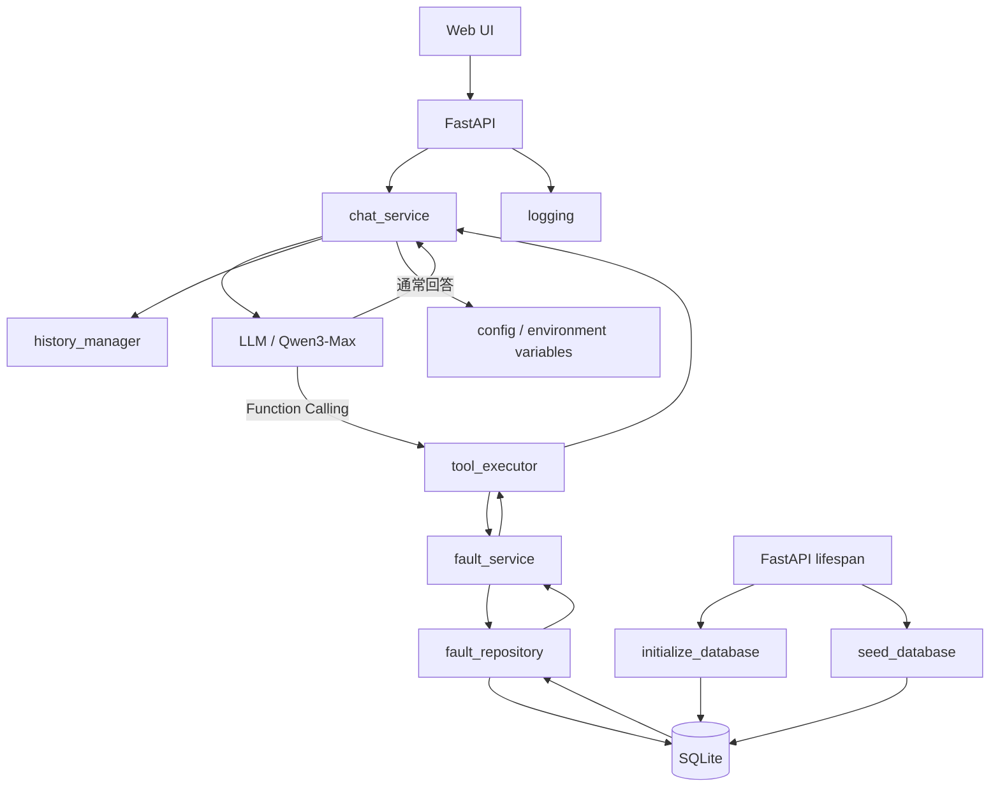

# Fault Record Intelligent Assistant

**Online Demo:** https://fault-assistant.onrender.com

**Tech Stack:** Python / FastAPI / Qwen3-Max / Function Calling / SQLite / pytest / Docker / Render

## 概要

Fault Record Intelligent Assistant は、LLM と Function Calling を利用して、障害記録を自然言語で検索・集計できる Web アプリケーションです。

ユーザーが入力した質問内容を LLM が解析し、必要に応じて適切な検索ツールを選択します。
アプリケーション側で SQLite データベースを検索し、その結果を LLM に返すことで、自然な文章として回答を生成します。

また、複数ユーザーの会話を `session_id` ごとに管理し、一定数の会話履歴を保持することで、文脈を考慮した複数ターンの対話にも対応しています。

FastAPI による REST API、Web UI、SQLite、pytest、Docker を利用して構成し、Render 上にデプロイしています。

## 主な機能

* 自然言語による障害記録の検索
* 障害 ID を指定した詳細検索
* severity（high / medium / low）による障害検索
* severity ごとの障害件数集計
* LLM Function Calling によるツール自動選択
* 通常会話と Function Calling の両方に対応
* `session_id` ごとの独立した会話履歴管理
* 最大 5 ラウンドの会話履歴保持・自動削除
* 会話履歴のクリア機能
* FastAPI を利用した `/chat` API
* Pydantic による入力値チェック
* logging によるリクエスト・エラー記録
* pytest / monkeypatch を利用した自動テスト
* Web UI からのチャット操作
* Docker によるコンテナ化
* アプリケーション起動時の SQLite 自動初期化
* Render を利用したクラウドデプロイ

## 技術スタック

### Backend

* Python
* FastAPI
* Pydantic
* Uvicorn

### LLM

* DashScope API
* Qwen3-Max
* Function Calling

### Database

* SQLite

### Frontend

* HTML
* CSS
* JavaScript
* Fetch API

### Test

* pytest
* FastAPI TestClient
* monkeypatch

### Infrastructure / Deployment

* Docker
* Render
* GitHub

### Configuration / Logging

* python-dotenv
* logging

## アーキテクチャ



### 各レイヤーの役割

* **Web UI**
  ユーザー入力を受け取り、Fetch API を利用して FastAPI の `/chat` API を呼び出します。

* **FastAPI**
  HTTP リクエストを受信し、Pydantic による入力値チェックを行った後、LLM 処理を呼び出します。

* **chat_service**
  LLM とのやり取り全体を管理します。
  通常回答と Function Calling の判定、ツール実行後の再問い合わせ、会話履歴の保存などを担当します。

* **LLM（Qwen3-Max）**
  ユーザーの質問内容を解析し、通常回答を返すか、必要な Function Calling を要求します。

* **tool_executor**
  LLM から指定されたツール名と引数を受け取り、対応する Service 層の処理を実行します。

* **fault_service**
  severity や ID などの入力値を検証し、Repository 層を呼び出します。

* **fault_repository**
  SQLite に対する SQL の実行を担当します。

* **SQLite**
  障害記録を保存します。

### その他のコンポーネント

* **history_manager**
  `session_id` ごとに会話履歴を管理し、最大 5 ラウンドまで保持します。

* **config**
  API Key、LLM モデル名、履歴保持数などの環境変数を管理します。

* **logging**
  API リクエストや異常発生時のログを記録します。

* **lifespan**
  FastAPI 起動時に SQLite データベースと初期データを準備します。

## 処理フロー

### 通常会話

```text
1. ユーザーが Web UI からメッセージを送信
2. Fetch API で POST /chat を呼び出す
3. FastAPI がリクエストを受信
4. chat_service が過去の会話履歴を含めて LLM に送信
5. LLM が通常回答を生成
6. 会話履歴を保存
7. FastAPI が回答を Web UI に返却
```

### Function Calling を利用する場合

```text
1. ユーザーが障害情報について質問
2. FastAPI が chat_service を呼び出す
3. chat_service が質問と会話履歴を LLM に送信
4. LLM が必要な Function と引数を選択
5. tool_executor が指定された Function を実行
6. fault_service が入力値を確認
7. fault_repository が SQLite を検索
8. 検索結果を tool_executor に返却
9. chat_service が検索結果を LLM に再送信
10. LLM が検索結果を自然言語の回答に変換
11. 会話履歴を保存
12. FastAPI が最終回答を Web UI に返却
```

この構成では、LLM が直接 Python や SQL を実行するのではなく、LLM は利用するツールを選択し、実際の処理はアプリケーション側で実行します。

## セットアップ

### 1. リポジトリを取得

```bash
git clone https://github.com/zhaoyangyang125/fault-assistant.git
cd fault-assistant
```

### 2. 仮想環境を作成・有効化

Windows PowerShell の場合：

```powershell
python -m venv .venv
.\.venv\Scripts\Activate.ps1
```

### 3. 依存ライブラリをインストール

```powershell
pip install -r requirements.txt
```

### 4. 環境変数を設定

`.env.example` を参考に `.env` を作成します。

例：

```env
DASHSCOPE_API_KEY=your_api_key
LLM_MODEL=qwen3-max
MAX_ROUNDS=5
```

API Key は GitHub にコミットしないようにしてください。

### 5. アプリケーションを起動

```powershell
uvicorn app.main:app --reload
```

起動後、ブラウザから以下にアクセスします。

```text
http://localhost:8000
```

## Docker での起動方法

### Docker Image をビルド

```powershell
docker build -t fault-assistant .
```

### Container を起動

```powershell
docker run --name fault-assistant-app -p 8000:8000 --env-file .env fault-assistant
```

起動後：

```text
http://localhost:8000
```

から Web UI を利用できます。

アプリケーション起動時に SQLite データベースと初期データが自動的に作成されます。

## オンラインデモ

Render 上にデプロイしています。

**Demo:** https://fault-assistant.onrender.com

ブラウザから直接チャット機能を試すことができます。

入力例：

```text
highの障害は何件ありますか？
```

LLM が Function Calling を利用して必要な検索ツールを選択し、SQLite の検索結果をもとに回答を生成します。

## テスト

pytest を利用して Service 層と FastAPI API の自動テストを実装しています。

テスト実行：

```powershell
python -m pytest
```

主なテスト内容：

* Service 層の検索・集計処理
* `/chat` API の正常系
* Pydantic による入力値チェック
* 空文字・空白文字のバリデーション
* session ごとの履歴管理
* 会話履歴クリア API
* monkeypatch を利用した LLM 呼び出しのモック

現在のテスト結果：

```text
12 passed
```

## 今後の改善予定

* 会話履歴の永続化
* SQLite から PostgreSQL などへの移行
* より多くの障害検索条件への対応
* 認証機能の追加
* CI/CD の導入
* クラウド環境の強化
* RAG を利用した文書検索機能への拡張
